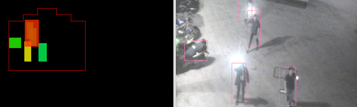

fachada-yolo2Tracking
============ 



Description
------------

App yolo2 to detect persons and track them in real time.
Results are send by OSC protocol. 
Yolo2 uses GPU with Cuda8/9.
This is an fast written example of how to use Yolo2 ( ofxDarknet ) plus tracker from ofxCv. 
Has some other features like spout for sharing video capture in windows to other compatible softwares.  

## For installation:

Once all required addons are properly installed in your OF folder: ReGenerate the project, and afollow instructions derived from external addons. Check following addons and comments.

 * Required addons: 
     - ofxImGui: (https://github.com/jvcleave/ofxImGui)
     - ofxDarknet: (https://github.com/mrzl/ofxDarknet)
              There are some more necessary steps that don't work with the OF project generator
              Compile as Debug or Release in x64 mode
              Within VS2015 Solution Explorer, rightclick on the generated project -> Build Dependencies -> Build Customizations -> Tick CUDA 8.0 --> windows10 64 bits local exe installer --> https://developer.nvidia.com/cuda-80-ga2-download-archive
              Copy pthreadVC2.dll from ofxDarknet\libs\3rdparty\dll\x64 to your applications bin folder

     
     - ofxCv: (https://github.com/kylemcdonald/ofxCv/tree/stable)
               - stable version and reset this propertie: c++ -> output files --> Object File name --> $(IntDir)/%(RelativeDir)/
               # require small hack: add this func as public:
              
               ```
               //Header Tracker.h
               vector<TrackedObject<T> > getCurrentRaw();

               //Source Tracker.cpp
               template<class T>
               inline vector<TrackedObject<T>> Tracker<T>::getCurrentRaw()
               {
                    return current;
               }
               ```
    - ofxSpout2 (https://github.com/Kj1/ofxSpout2) //Only for windows. Comment include headear if you do not wish this feature // TODO try trhis fork (https://github.com/sheridanis/ofxSpout2), that fix     potencial crash

     - ofxOpenCv (internal OF)
     - ofxGui (internal OF)
     - ofxOsc (internal OF)
     
 * Require specific weights COCO  ( https://pjreddie.com/media/files/yolo.weights ) From Yolo: https://pjreddie.com/darknet/yolo/
    - cfg and names are already included in this repo- 
 
 
  
